Insightful - SaaS Analytics Dashboard
- A modern full-stack analytics dashboard built with Laravel and React that provides real-time business insights, event tracking, reporting, and user management.

LIVE DEMO
- FRONTEND
  [Live Demo](https://saas-analytics-platform-kappa.vercel.app)
- BACKEND
  [Live Demo](https://saas-analytics-platform.onrender.com)

DEMO ACCOUNT
- Email = harrypotter@gmail.com
- Password = harry12345
- The dashboard is preloaded with over 1000 generated sample events for analytics, reports, charts, and business intelligence demonstrations.
- Alternatively, you can create your own account using the Register page.

SCREENSHOTS
- DASHBOARD
  
- 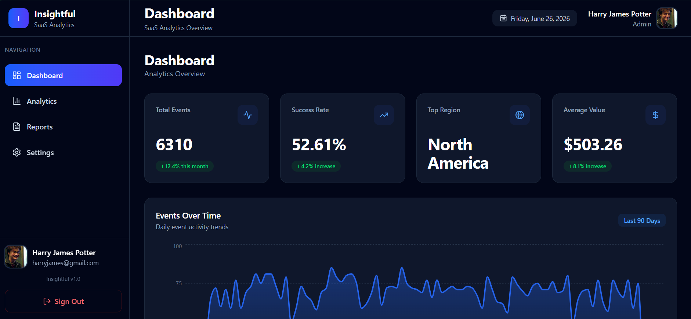
- 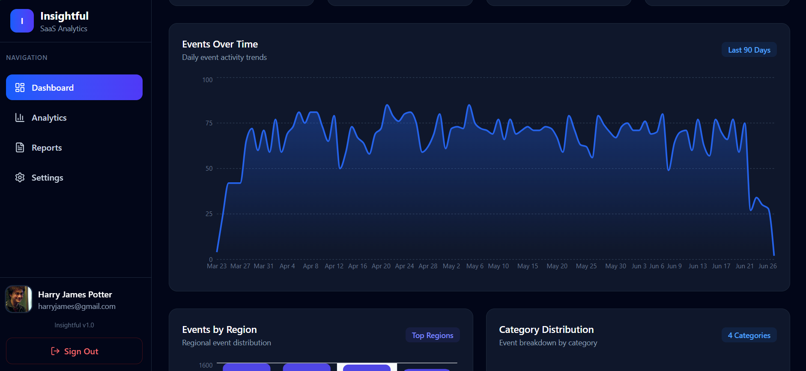
- 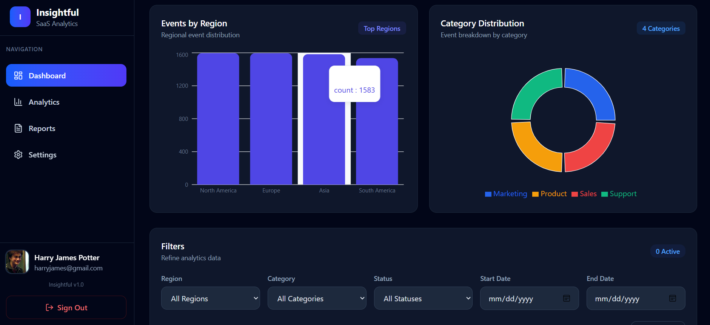
- 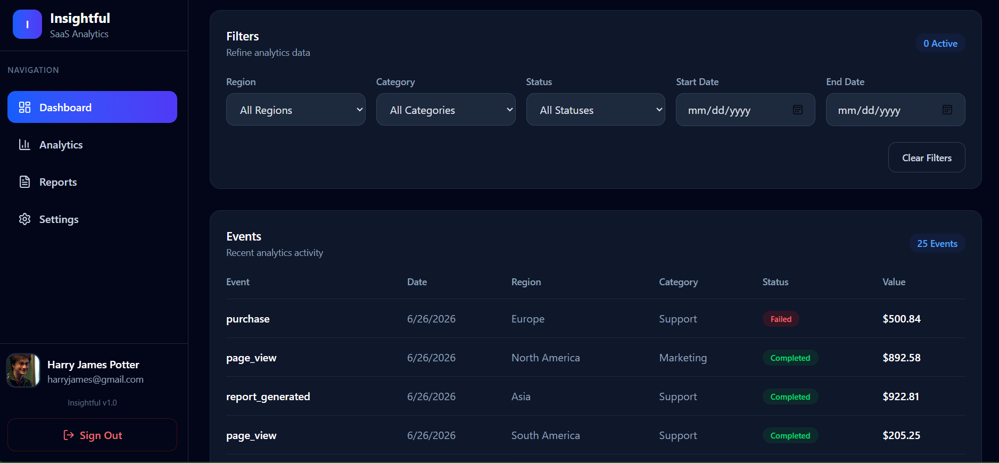

- ANALYTICS
- 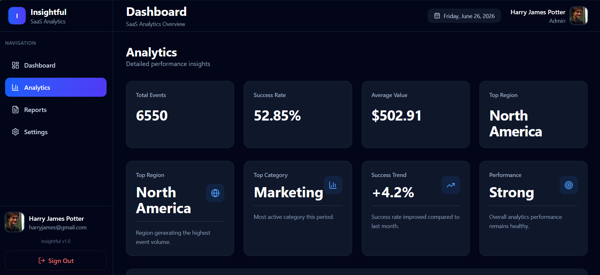
- 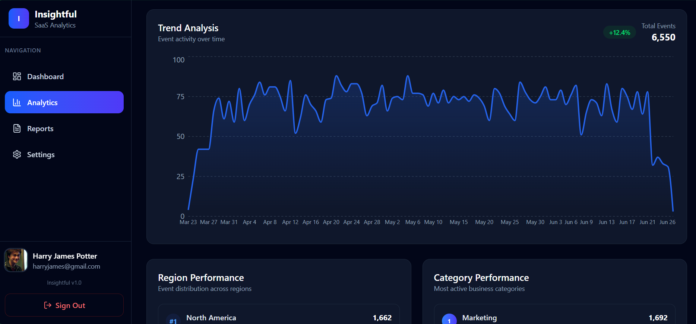
- 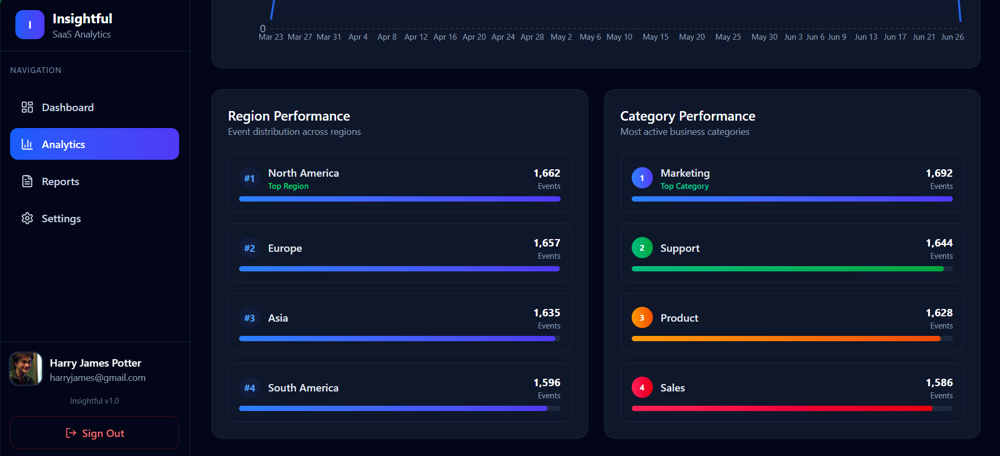

- REPORTS
- 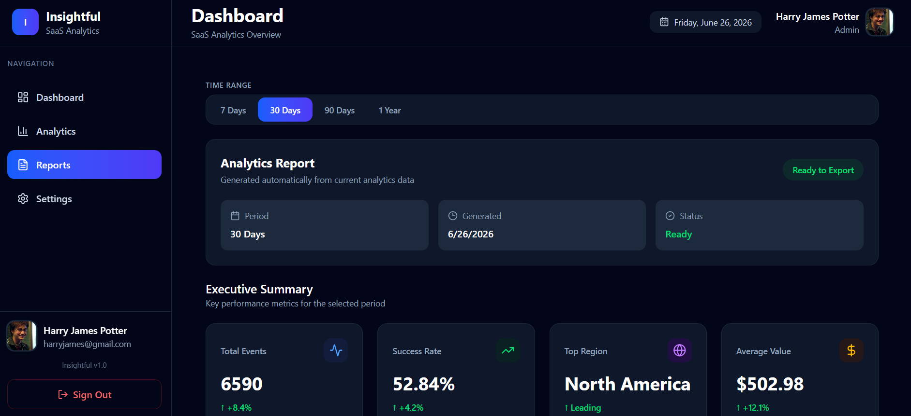
- 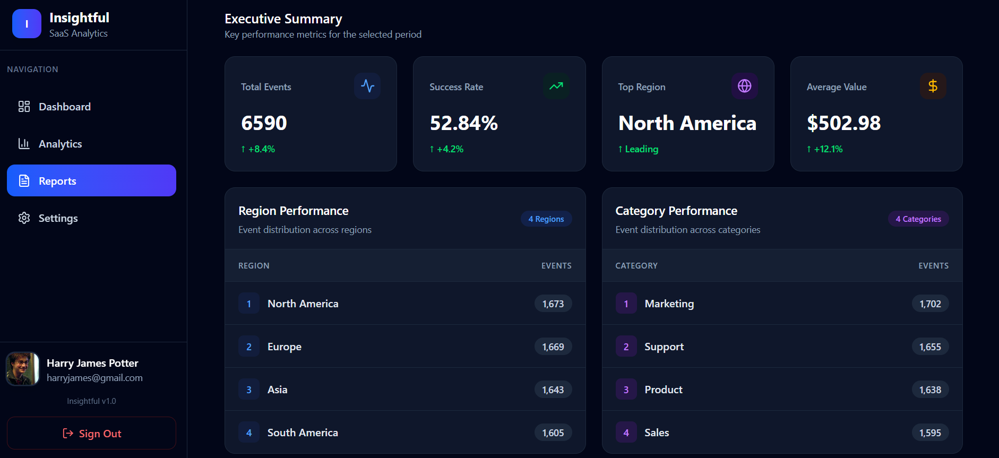
- 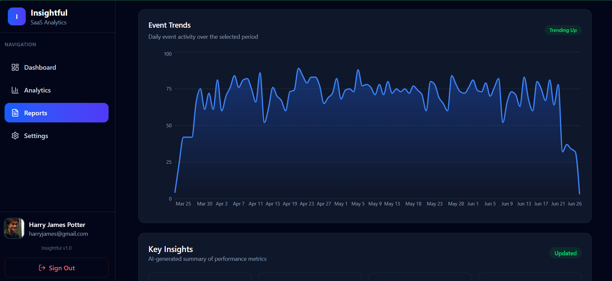
- 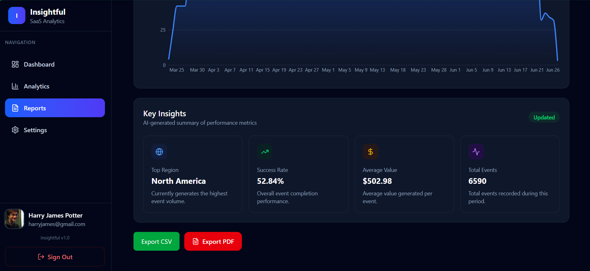

- SETTINGS
- 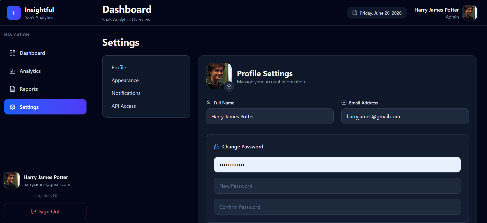
- 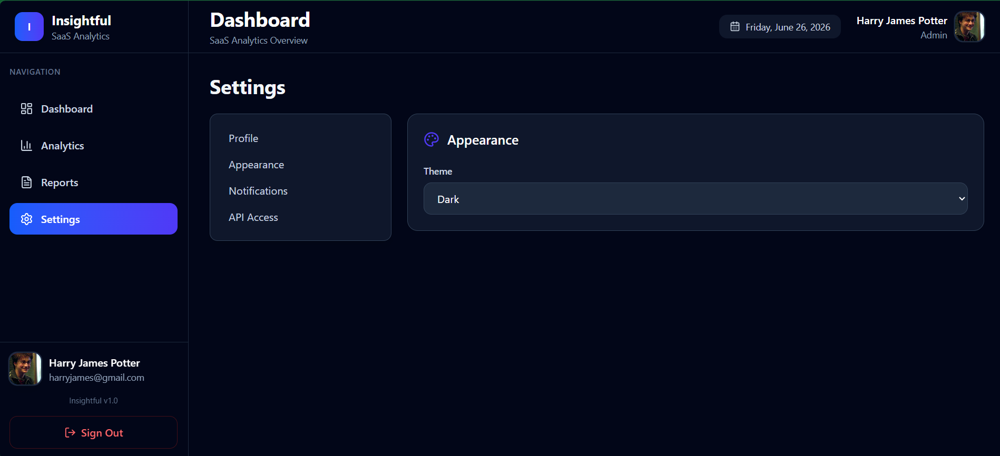
- 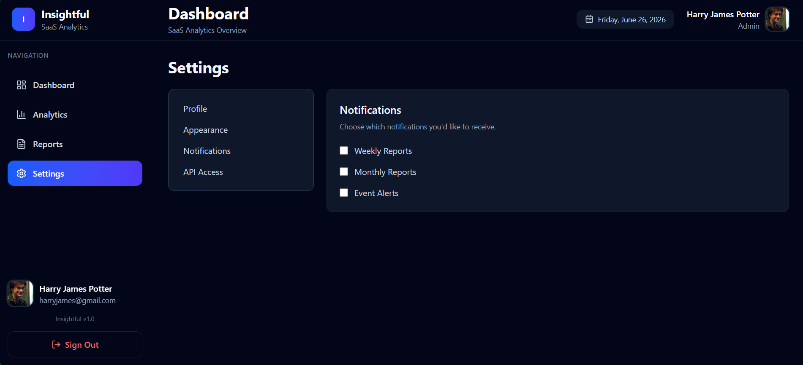
- 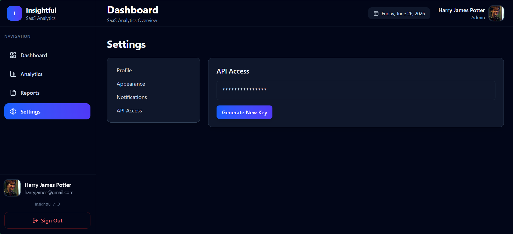

- AUTH
- 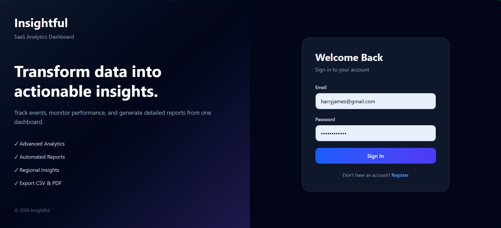
- 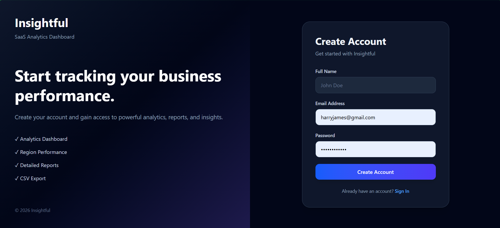
  
FEATURES
- AUTHENTICATION AND SECURITY
  * User Registrattion
  * User Login
  * Laravel Sanctum Authentication
  * Protected Routes
  * Password Change
  * Profile Management
  * Secure API Authentication

- DASHBOARD
  * Total Events KPI
  * Success Rate KPI
  * Average Value KPI
  * Top Region KPI
  * Events Over Time Visualization
  * Region Analytics
  * Category Analytics
  * Event Activity Monitoring
    
- ANALYTICS
  * Advanced Performance Insights
  * Trend Analysis
  * Regional Performance Reports
  * Category Performance Reports
  * Interactive Charts
  * Business Intelligence Metrics

- REPORTS
  * Executive Summary
  * Trend Reports
  * Region Reports
  * Category Reports
  * CSV Export
  * PDF Export
  * Date Range Filtering

- USER PROFILE
  * Update Name
  * Update Email
  * Upload Profile Photo
  * Change Password
  * Account Management

- UI/UX
  * Responsive Design
  * Dark Mode
  * Modern Dashboard Layout
  * Interactive Charts
  * Toast Notifications
  * Clean Component Architecture

TECH STACK
- FRONTEND
  * React 19
  * TypeScript
  * React Router DOM
  * Axios
  * Taiwind CSS v4
  * Recharts
  * Lucide React Icons
  * React Hot Toast

- BACKEND
  * Laravel 12
  * Laravel Sanctum
  * Eloquent ORM
  * REST API
  * POSTGRESQL

PROJECT STRUCTURE

frontend/
|
|── src/
|    |── assets/
|    |── components/
|    |      |── analytics/
|    |      |── auth/
|    |      |── charts/
|    |      |── dashboard/
|    |      |── layout/
|    |      |── reports/
|    |      |── settings/
|    |── context/
|    |      |── AuthContext
|    |      |── ThemeContext
|    |── hooks/
|    |      |── useReports
|    |── lib/
|    |      |── api
|    |── pages/
|    |      |── Analytics
|    |      |── Dashboard
|    |      |── Login
|    |      |──Register
|    |      |── Reports
|    |      |── Settings
|    |── routes/
|    |      |── AppRoutes
|    |── services/
|    |      |── analytics.service
|    |      |── auth.service
|    |      |── profile.service
|    |── types/
|    |      |── analytics
|    |      |── auth
|    |      |── event
|    |      |── report
|____ public/

backend/
|
|── app/
|      |── console/
|      |── Http/
|      |      |── Controllers
|      |── Models/
|      |── Providers/
|── bootstrap/
|── config/
|── database/
|      |── factories/
|      |── migrations/
|      |── seeders/
|      |── routes/
|______ resources/

DARK MODE
- The application includes custom Theme Context implementation with support for:
  * Dark Mode
  * Light Mode
  * System Preference Detection
    
FUTURE IMPROVEMENTS
- Role Based Access Control
- Real-Time Analytics
- WebSocket Integration
- Advanced Filtering
- Scheduled Reports
- Email Notifications
- Multi-Tenant Support
- AI Insights
- Data Forecasting

AUTHOR 
- Jemae Lyn Bandiola

LinkedIn: 
www.linkedin.com/in/jemae-lyn-bandiola-3ba2693b6

  

